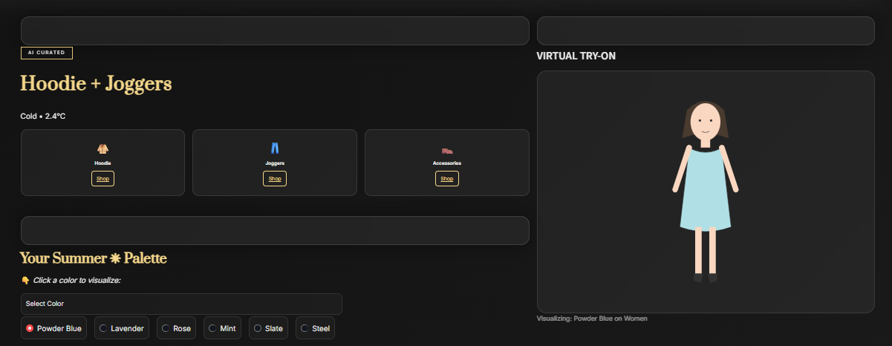
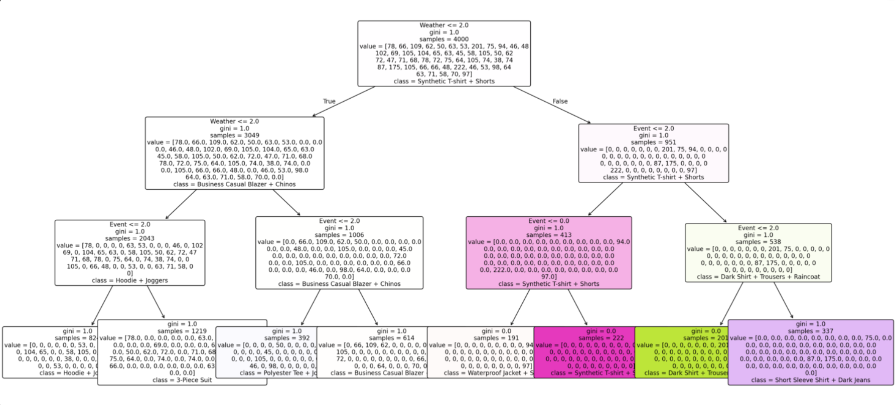

# 💎 Vogue AI: The Intelligent Wardrobe Consultant

**Vogue AI** is a personalized fashion recommendation system that bridges the gap between **Machine Learning** and **Algorithmic Color Science**. 

Unlike generic recommendation apps, it uses a **Hybrid Intelligence Engine** to predict outfit styles based on weather/occasion utility, while strictly adhering to color theory rules to match the user's skin undertones.


*(Replace with your actual image path)*

## 🚀 Key Features

* **Hybrid Inference Engine:** Combines a **Decision Tree Classifier** for style prediction with a **Rule-Based Algorithm** for Seasonal Color Analysis.
* **Real-Time Context Awareness:** Fetches live weather data to ensure outfit practicality.
* **Dynamic SVG Rendering:** A custom-built visualization engine that generates "Virtual Try-On" mannequins in real-time using Python (no static images used).
* **Explainable AI (XAI):** Includes a visualization of the Decision Tree logic to ensure transparency in recommendations.
* **Smart Shopping Integration:** Dynamically generates e-commerce search links for the recommended items.

## 🧠 How It Works

The system processes data in three layers:

1.  **Input & Encoding:** * User inputs (City, Event, Skin Tone) are captured and converted into numerical vectors using **Label Encoding**.
    * Weather data is fetched via API and categorized (Cold, Hot, Rainy).

2.  **The Dual-Core Brain:**
    * **Style Predictor (ML):** A `DecisionTreeClassifier` analyzes the context (Weather + Event) to predict the clothing combination (e.g., "Hoodie + Joggers").
    * **Color Analyst (Logic):** A deterministic algorithm applies **Seasonal Color Theory** to map Skin Tone + Undertone to a specific color palette (e.g., Autumn Palette).

3.  **Dynamic Visualization:**
    * The system injects the predicted *Outfit Shape* and the calculated *Hex Color* into an SVG template to render the mannequin instantly.

## 🛠️ Tech Stack

* **Frontend:** Streamlit, Custom CSS (Glassmorphism UI)
* **Machine Learning:** Scikit-Learn (Decision Tree)
* **Data Processing:** Pandas, NumPy, Joblib
* **Visualization:** Matplotlib, Python SVG Injection
* **API:** OpenWeatherMap / REST API

## 📸 Screenshots

### The Virtual Try-On & Color Palette


### The Decision Logic (Explainable AI)


## 📦 Installation

1.  **Clone the repository:**
    ```bash
    git clone [https://github.com/your-username/vogue-ai.git](https://github.com/your-username/vogue-ai.git)
    cd vogue-ai
    ```

2.  **Install dependencies:**
    ```bash
    pip install -r requirements.txt
    ```

3.  **Run the app:**
    ```bash
    streamlit run app.py
    ```

## 🔮 Future Scope
* **Computer Vision:** Allow users to upload photos of their own wardrobe.
* **Collaborative Filtering:** Recommend items based on similar user trends.
* **AR Integration:** Overlay clothes onto the user's webcam feed using MediaPipe.

---
*Created by KRISHIKA*
